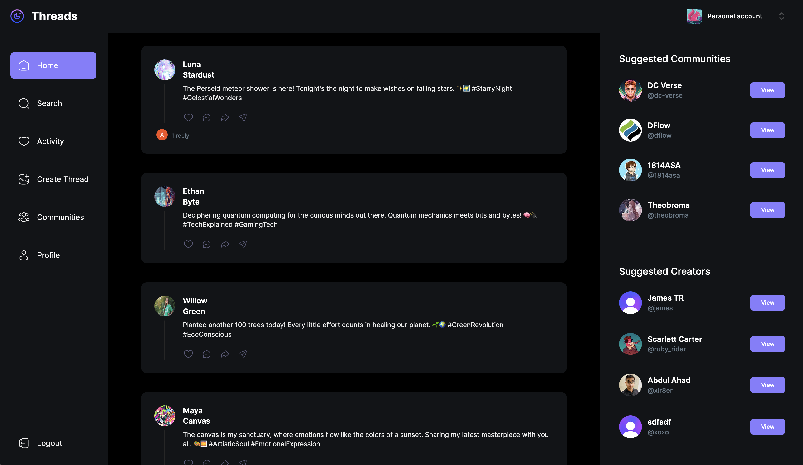

<h1 align="center">Welcome to Threads 👋</h1>

<div align="center">


</div>

<h2 align="center">Threads is deployed and live, click <a href="https://www.threads.abdulahadsiddiqui.com" target="_blank" >here</a> and check it out now! </h2>

<p align="center">
  <a href="https://www.threads.abdulahadsiddiqui.com/" target="_blank"> 
    
  </a>
</p>

<br />
<h4 align="center"> <em><strong>Threads</strong> - Where Your Conversations Create Communities. An open-source platform built with the power of Next.js 13, designed to host your discussions and build your communities with ease and style.</em></h4>

### Features You'll Love:

* **Responsive Design**: Threads ensures a smooth and friendly user experience with a design that looks great on all devices.

* **Secure Sign In Options**: 
  - Easy sign up/sign in with username and password.
  - Or use your Apple, Facebook, Github, Google, LinkedIn, or Microsoft account for quick access.

* **Discover Threads**: Navigate through a lively feed and dive into threads that pique your interest.

* **Smart Search**: Find and connect with creators, accounts, and communities effortlessly with our smart search.

* **Profile Just for You**: Manage and view all your threads, comments, and community interactions from your personalized profile page.

* **Create and Discuss**: 
  - Start new threads, engage in discussions, and keep the conversation going by commenting on comments.
  - Build, manage, and engage with communities, ensuring every topic has a dedicated space for discussion.

* **Real-time Google Analytics**: Track and assess user activity using Google Analytics, helping you make data-driven decisions.

### Why Threads?

Threads isn’t just another social media - it’s a space where your thoughts find a community. A space where discussions are not just seen, but are also heard and respected.

- 🗣 **Speak Up**: Start threads on topics you care about.
- 🌐 **Build Communities**: Create spaces for specific topics and bring like-minded individuals together.
- 🔎 **Explore**: Discover creators and communities that share your interests.
- 📊 **Stay Informed**: Real-time analytics to keep you updated about your interactions and community growth.

### Threads - Your Thoughts. Your Community.

Engage in discussions, discover new communities, and maybe, start a few of your own. With Threads, your thoughts and conversations build communities. A platform where your words weave into meaningful interactions and discussions. Welcome to [Threads](https://www.threads.abdulahadsiddiqui.com/) - let's start talking.


## Tech. stack
### Front-end stack
* [TypeScript](https://www.typescriptlang.org/)
* [Next.js](https://nextjs.org/)
* [React.js](https://reactjs.org/)
* [Tailwind CSS](https://tailwindcss.com/)

### Back-end stack
* [Next.js](https://nextjs.org/) : Server Actions, Webhooks, & Client-Side Data Fetching
* [MongoDB](https://www.mongodb.com/docs/) : Database
* [Clerk](https://clerk.com/solutions/nextjs-authentication) : Authentication & User management
* [UploadThing](https://docs.uploadthing.com/) : File hosting & user data storage

## Installing locally

### Setting up MongoDB
* Create a <i>MongoDB Atlas</i> account.
* Check out [MongoDB](https://www.mongodb.com/docs/) for a step by step guide
* Once you have your MongoDB ready, fill in your env. varilables and proceed with the next steps

### Obtaining Clerk Auth credentials for Authentication and User management
* Create a new application on [Clerk Dashboard](https://dashboard.clerk.com/) to get the credentials
* Add a new webhook endpoint to listen for changes on the Clerk side. 
* The endpoint would be:
> ```domain-where-this-project-is-hosted/api/webhook/clerk```
* While configuring the webhook endpoint, subscribe for the following events (Select these from Event Catalog):
> * ```organization.updated```
> * ```organizationMembership.created```
> * ```organizationDomain.created```
> * ```organizationMembership.updated```
> * ```organizationDomain.deleted```
> * ```organization.deleted```
> * ```organization.created```
> * ```organizationMembership.deleted```
> * ```organizationInvitation.created```
> * ```organizationDomain.updated```
> * ```organizationInvitation.revoked```
> * ```organizationInvitation.accepted```

### Obtaining UploadThing credentials for file storage
* Create a new app on [UploadThing Dashboard](https://uploadthing.com/dashboard) to get the credentials.


### Setting up dev. environment variables
* Create a new file ```.env.local``` under ```./``` and fill the following 11 variables
```sh
NEXT_PUBLIC_CLERK_PUBLISHABLE_KEY = < Clerk Publick Key >

CLERK_SECRET_KEY = < Clerk Secret >

NEXT_CLERK_WEBHOOK_SECRET = < Clerk Webhook Secret >

NEXT_PUBLIC_CLERK_SIGN_IN_URL = /sign-in

NEXT_PUBLIC_CLERK_SIGN_UP_URL = /sign-up

NEXT_PUBLIC_CLERK_AFTER_SIGN_IN_URL = /

NEXT_PUBLIC_CLERK_AFTER_SIGN_UP_URL = /

MONGODB_URL = < MONGODB URL >

UPLOADTHING_SECRET  = < UploadThing Secret >

UPLOADTHING_APP_ID = < UploadThing App ID >

GA_TRACKING_ID = < YOUR GOOGLE ANALYTICS MEASUREMENT ID >
```

### Installing dependencies
* Use the following command in your terminal from ```./``` to install project dependencies
```sh
npm install
< or >
yarn install
< or >
pnpm install
```

### Starting the development server
* After you have installed dependencies, use the following command in your terminal from ```./``` to start the dev. server
```sh
npm run dev
< or >
yarn dev
< or >
pnpm dev
```
* Visit ```http://localhost:3000``` to view Threads on your local machine

## Build & Deploy

### Environment variables
* Update the evniornment variables on your hosting platform before building
```sh
NEXT_PUBLIC_CLERK_PUBLISHABLE_KEY = < Clerk Publick Key >

CLERK_SECRET_KEY = < Clerk Secret >

NEXT_CLERK_WEBHOOK_SECRET = < Clerk Webhook Secret >

NEXT_PUBLIC_CLERK_SIGN_IN_URL = /sign-in

NEXT_PUBLIC_CLERK_SIGN_UP_URL = /sign-up

NEXT_PUBLIC_CLERK_AFTER_SIGN_IN_URL = /

NEXT_PUBLIC_CLERK_AFTER_SIGN_UP_URL = /

MONGODB_URL = < MONGODB URL >

UPLOADTHING_SECRET  = < UploadThing Secret >

UPLOADTHING_APP_ID = < UploadThing App ID >

GA_TRACKING_ID = < YOUR GOOGLE ANALYTICS MEASUREMENT ID >
```

### Build command
* Use the following commands for building and deploying
```sh
npm run build
< or >
next build
```

### Install command
```sh
npm install
< or >
yarn install
< or >
pnpm install
```
* Congratulations your Threads app is up and running!

## Author

👤 **Abdul Ahad Siddiqui**

* Github: [@AbdulAhadSiddiqui11](https://github.com/AbdulAhadSiddiqui11)
* LinkedIn: [@abdulahadsiddiqui11](https://linkedin.com/in/abdulahadsiddiqui11)

## 🤝 Contributing

Contributions, issues and feature requests are welcome!<br />Feel free to check [issues page](https://github.com/AbdulAhadSiddiqui11/threads/issues). 

## Show your support

Give a ⭐️ if this project helped you!

## 📝 License

Copyright © 2023 [Abdul Ahad Siddiqui](https://github.com/AbdulAhadSiddiqui11).<br />
This project is [MIT](./LICENSE) licensed.
